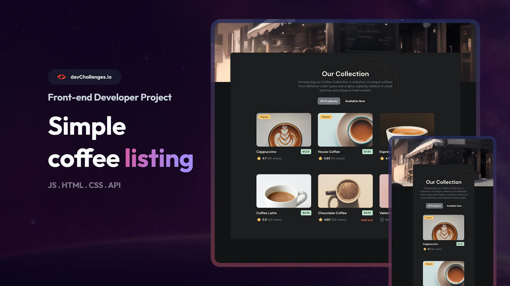

<h1><a href="https://devchallenges.io/challenge/simple-coffee-listing">Simple Coffee Listing</a></h1>

This challenge is great for working with Front-end libraries like React, Vue,... You will need to implement a reusable card component with different variables based on the data given.

- Create a coffee listing page that matches the given design.

- Use React or other Front-end libraries for this challenge.

- Create a Reusable Card component.

- The card component should include a picture, name, pricing,  rating, and number of votes if exists.

- The card component should render popular tag, availability status conditionally.

- Render Coffee list with given data. The data should come from a given API or downloaded JSON file.

- Users can choose to list all products or just available products.

- Deploy the solution and submit Repository URL and Demo URL.

